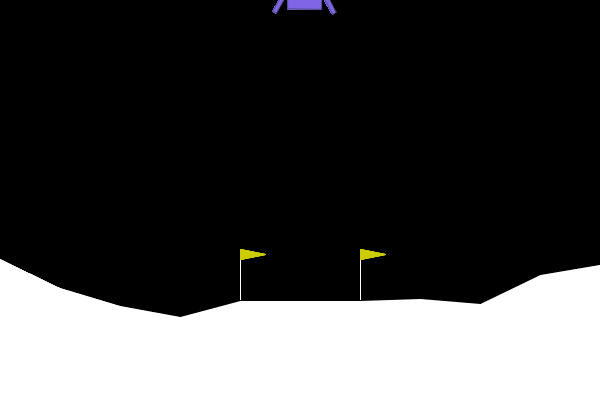

# PPO from Scratch

A minimal, configurable implementation of **Proximal Policy Optimisation** (PPO) in PyTorch, compatible with Gymnasium environments.  

---

## Features

- **Vectorised training & evaluation** with Gymnasium’s `SyncVectorEnv`/`AsyncVectorEnv`  
- **Generalised Advantage Estimation** (GAE) with optional normalisation  
- **Surrogate‐ratio & value‐function clipping** for stable updates  
- **Entropy bonus** (scaled by action‐dim) to encourage exploration  
- **Reproducible seeding** via per‐env RNGs  
- **TensorBoard logging** out of the box  
- **GIF‐recording** of policy rollouts

---

## Example rollout

<figure>
  
  <figcaption><em>Policy evaluation on LunarLander-v3 environment with strong wind.</em></figcaption>
</figure>

## Installation

Install the package in a virtual environment, e.g. using `venv`:

  ```bash
    python3 -m venv .venv
    source .venv/bin/activate
    pip install -r requirements.txt
    pip install -e .
  ```

## Configuration

By default, all hyperparameters are defined in [`default.yaml`](configs/default.yaml).  
This file controls training settings, model architecture, and the environment to be used.

You can modify this configuration or provide your own YAML file and pass it to the trainer.

## Quickstart

```python
from trainer.train import PPOTrainer

# 1) Initialise trainer (loads default.yaml)
trainer = PPOTrainer()

# 2) Train
trainer.train()

# 3) Evaluate average return
mean_r = trainer.mean_reward_eval()
print(f"Mean episode return: {mean_r:.2f}")

# 4) Record a GIF
trainer.render_policy_eval_gif()
```
